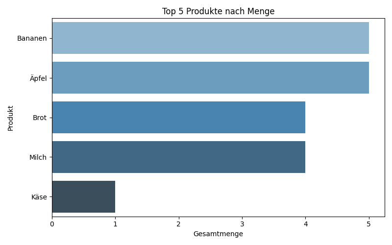

**Tag 30 – Warenkorb-Analyse 🛒**

Datum: 8. September 2025  
Dauer: 3 Stunden  
Thema: Datenanalyse von Einkaufslisten – Häufig gekaufte Produkte ermitteln

---

**Was habe ich gelernt?**

- Umgang mit Python und Datenanalyse  
- Nutzung von `pandas` für Gruppierungen und Summierungen  
- Erstellung von Diagrammen mit `matplotlib` & `seaborn`  
- Export von Ergebnissen in CSV-Dateien  
- Visualisierung von Top-Produkten durch Balkendiagramme  
- Vorbereitung von Daten für reale Anwendungsfälle im Handel (z. B. REWE)

---

**Verwendete Techniken**

| Code / Technik                 | Bedeutung / Einsatz                                      |
|--------------------------------|----------------------------------------------------------|
| `pandas.DataFrame`             | Erstellen und Analysieren der Einkaufsdaten              |
| `.groupby()` + `.sum()`        | Produkte nach Menge summieren                            |
| `.sort_values()`               | Häufigste Produkte ermitteln                             |
| `.to_csv()`                     | Ergebnisse als CSV speichern                             |
| `matplotlib.pyplot`            | Diagramme erstellen                                      |
| `seaborn.barplot`              | Balkendiagramm für Top-Produkte                         |

---

**Vorschau**

Analyseergebnisse (lokal generiert im `output/` Ordner):  

- [📊 CSV – Top-Produkte](output/top_produkte.csv)  
- 

---

**Projektdateien**

- `einkaufsliste.py` – Hauptskript mit Datenanalyse  
- `einkaufsliste.csv` – Optional: externe Einkaufsliste  
- `output/top_produkte.csv` – Ergebnisse als Tabelle  
- `output/top_produkte.png` – Visualisierung als Diagramm  
- `README.md` – Dokumentation und Lerneffekt  

---

**Wie funktioniert’s?**

1. Einkaufsliste laden (Beispieldaten oder CSV-Datei)  
2. Daten nach Produkten gruppieren und Mengen summieren  
3. Ergebnisse speichern (`top_produkte.csv`)  
4. Balkendiagramm der Top 5 Produkte generieren (`top_produkte.png`)  
5. Ergebnisse im Ordner `output/` einsehen  

---

**Fazit:**  
Die Warenkorb-Analyse zeigt, welche Produkte am häufigsten gekauft werden.  
Dieses Projekt eignet sich hervorragend als **Mini-Einblick in Data Analytics**, insbesondere für den Handel, und zeigt praxisnah die Vorteile von **Python** für Datenanalyse und Visualisierung.
